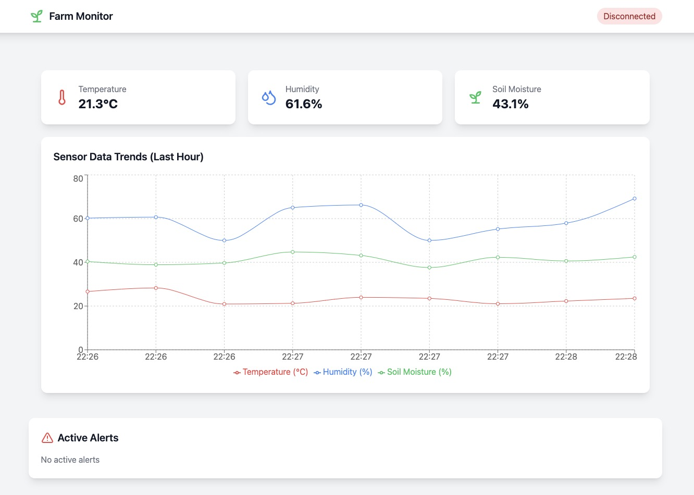

# 🌾 Farm Management System

**A real-time farm monitoring system simulating IoT device data collection for agricultural environments with live visualization and alerts.**


## ✨ Features

- 📊 **Real-time monitoring**: Temperature, humidity, soil moisture  
- 📈 **Interactive data visualization** with dynamic charts  
- ⚡ **WebSocket-powered updates** for real-time data  
- 🔔 **Automated alerts** for critical conditions  
- 🤖 **Mock data generation** for testing  

---

## 🛠️ Tech Stack

### Frontend  
- ⚛️ React + TypeScript  
- 🎨 Tailwind CSS  
- 📊 Recharts for visualization  
- 🟢 Socket.IO (client)  
- ✨ Lucide React icons  

### Backend  
- 🐍 FastAPI (Python)  
- 🐘 PostgreSQL (database)  
- 🔥 Redis (caching)  
- 🟠 Socket.IO (server)  
- 🐳 Docker (containerization)  

---

## 🚀 Quick Start

1. **Frontend Setup**  
   ```bash
   cp .env.example .env
   npm install
   npm run dev
   ```
   Access: [http://localhost:5173](http://localhost:5173)

2. **Backend Setup**  
   ```bash
   cd backend
   cp .env.example .env
   python3.9 -m venv venv
   source venv/bin/activate  # Windows: `venv\Scripts\activate`
   pip install -r requirements.txt
   docker compose up
   ```
   - FastAPI: [http://localhost:8000](http://localhost:8000)

---

## 🔗 API Endpoints

### REST  
- `GET /api/data`: Fetch latest 100 readings  
- `POST /api/data`: Submit sensor data (fields: `deviceId`, `temperature`, `humidity`, `soilMoisture`)  

### WebSocket Events  
- **`sensor_data`**: Live sensor updates  
- **`alert`**: Alerts for critical thresholds  

---

## 📂 Folder Structure  

### Frontend  
```plaintext
src/
├── components/        # UI components
├── types/             # TypeScript types
├── App.tsx            # Main app component
└── main.tsx           # Entry point
```

### Backend  
```plaintext
backend/
├── app/
│   ├── models.py      # Database models
│   ├── schemas.py     # Pydantic schemas
│   ├── database.py    # Database setup
│   └── main.py        # FastAPI entry point
├── requirements.txt
└── docker-compose.yml
```

---

## 🐳 Docker Commands  

- **Start all services**: `docker compose up`  
- **Stop services**: `docker compose down`  
- **Access database**: `docker compose exec db psql -U postgres -d farm_management`  